<br />
<p align="center">
  <div align="center">
    
  </div>
  <h3 align="center">Blanja</h3>
  <p align="center">
    <a href="https://github.com/msuryasyahruli/blanja-web"><strong>Explore the docs »</strong></a>
    <br />
    <a href="https://blanja-market-web.vercel.app">View Demo</a>
    ·
    <a href="https://backend-blanja-v1.vercel.app/products/">Api Demo</a>
  </p>
</p>

<!-- TABLE OF CONTENTS -->

## Table of Contents

- [Table of Contents](#table-of-contents)
- [About The Project](#about-the-project)
  - [Built With](#built-with)
- [Getting Started](#getting-started)
  - [Prerequisites](#prerequisites)
  - [Installation](#installation)
  - [Setup .env](#setup-env)
- [Screenshots](#screenshots)
- [Contributing](#contributing)
- [Related Project](#related-project)
- [Contact](#contact)

<!-- ABOUT THE PROJECT -->

## About The Project

Blanja is an E-commerce website project that aims to provide an easy and convenient online shopping experience for users in Indonesia. The site offers a wide range of products, including fashion, beauty, electronics, food and beverages.

To use Blanja's services, users only need to create an account and enter their payment details. After that, users can browse products, add them to their shopping cart, and choose their preferred payment method.

With all the features and security provided, Blanja is expected to provide a safe, easy, and convenient online shopping experience for users across Indonesia.

<!-- GETTING STARTED -->

## Getting Started

### Prerequisites

This is an example of how to list things you need to use the software and how to install them.

- [Node.Js](https://nodejs.org/en/download/)
- [Bootstrap Css](https://getbootstrap.com/)
- [React JS](https://reactjs.org/)
- [Redux](https://redux.js.org/)

### Installation

- Clone This Front End Repo

```
git clone https://github.com/msuryasyahruli/blanja-web
```

- Go To Folder Repo

```
cd blanja-web
```

- Install Module

```
npm install
```

- <a href="#setup-env">Setup .env</a>
- Type ` npm run start` To Start Website
- Type ` npm run production` To Start Production

### Setup .env

Create .env file in your root project folder.

```
REACT_APP_API_KEY = [BACKEND_URL]
```

<!-- ROADMAP -->

## Screenshots

<table>
 <tr>
    <td>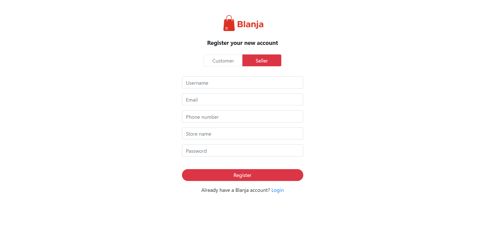</td>
    <td> 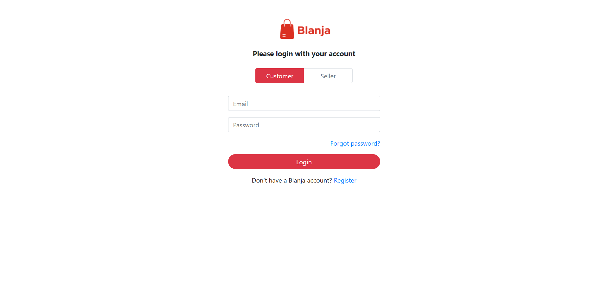</td>
  </tr>
   <tr>
    <td>Register</td>
    <td>Login</td>
  </tr>
  <tr>
    <td>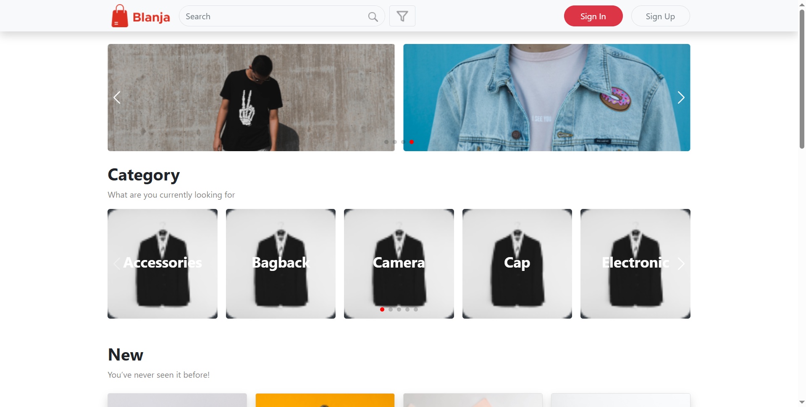</td>
    <td> 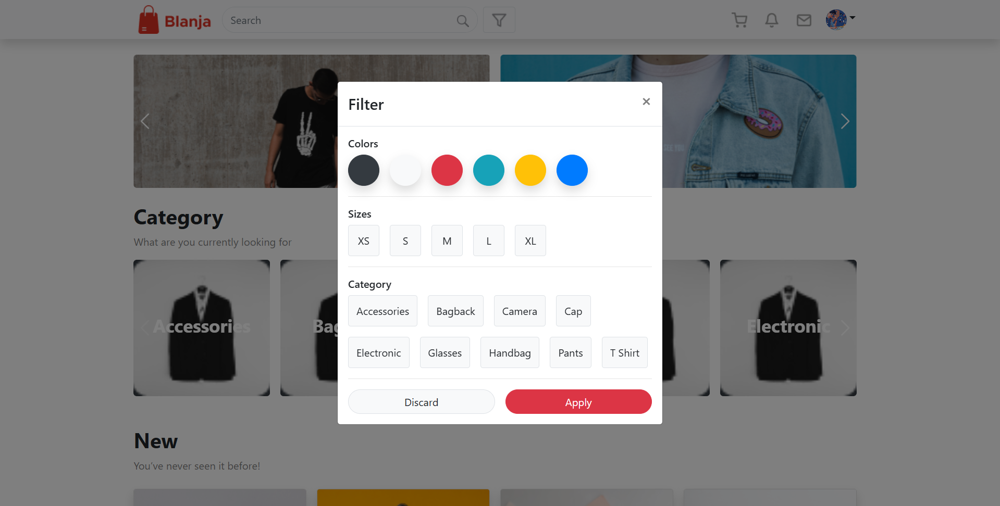</td>
  </tr>
   <tr>
    <td>Home</td>
    <td>Filter</td>
  </tr>
   <tr>
    <td>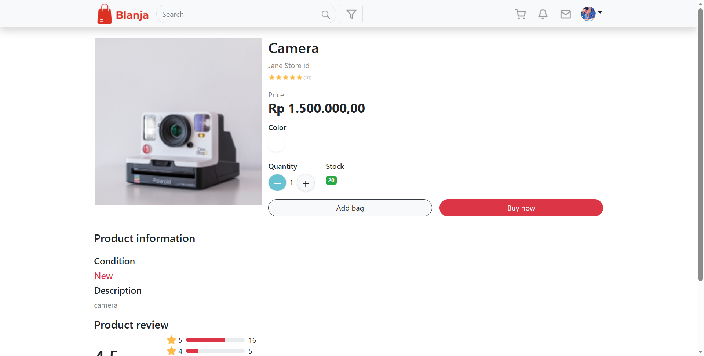</td>
    <td> 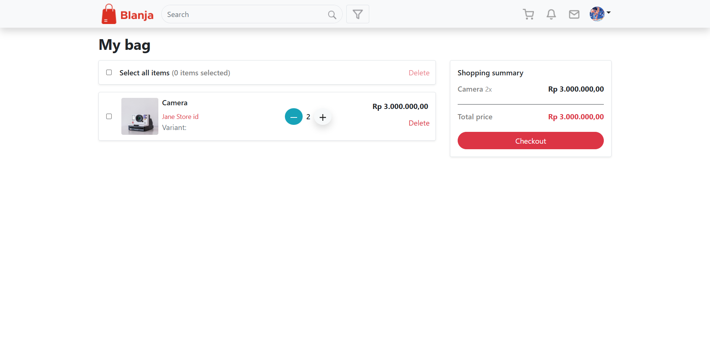</td>
  </tr>
   <tr>
    <td>Detail product</td>
    <td>Order product</td>
  </tr>
   <tr>
    <td>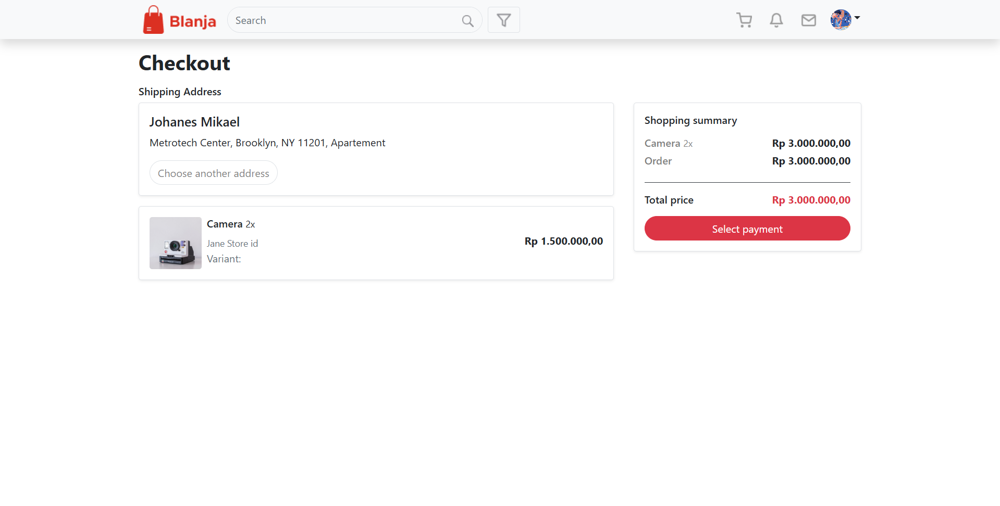</td>
    <td> </td>
  </tr>
   <tr>
    <td>Checkout product</td>
    <td>Payment method</td>
  </tr>
   <tr>
    <td>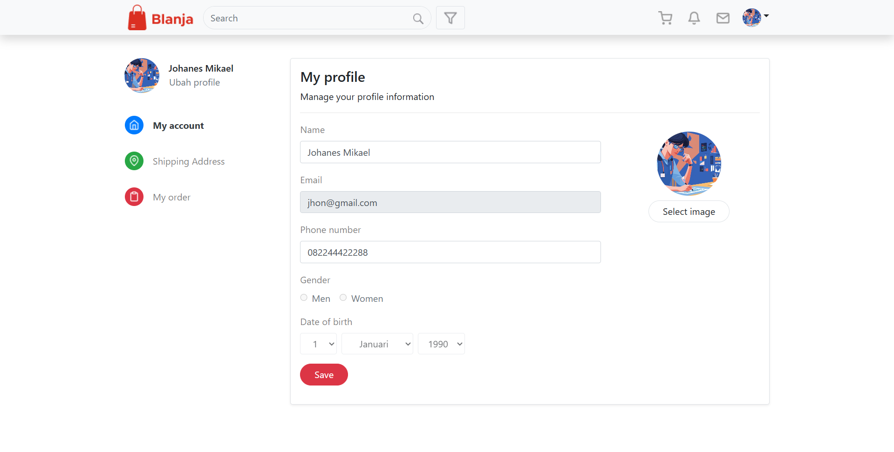</td>
    <td> 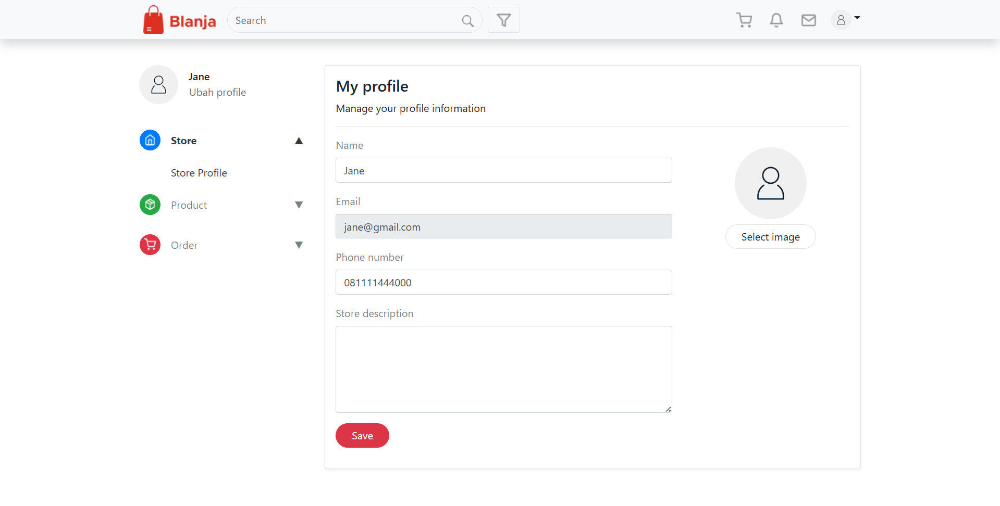</td>
  </tr>
   <tr>
    <td>Profile</td>
    <td>Store profile</td>
  </tr>
   <tr>
    <td></td>
    <td> 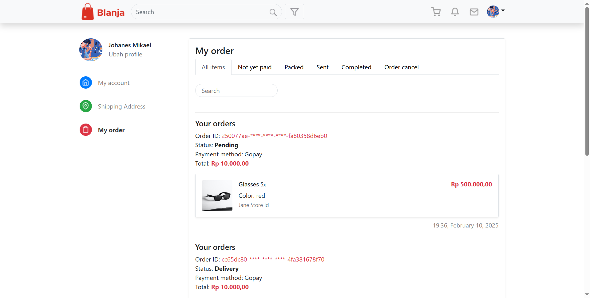</td>
  </tr>
   <tr>
    <td>Shipping address</td>
    <td>Orders items</td>
  </tr>
   <tr>
    <td>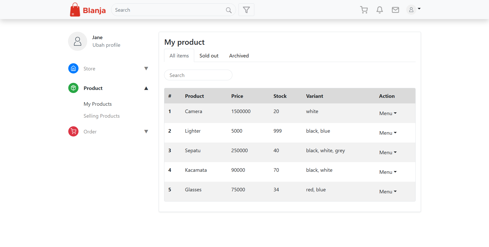</td>
    <td> 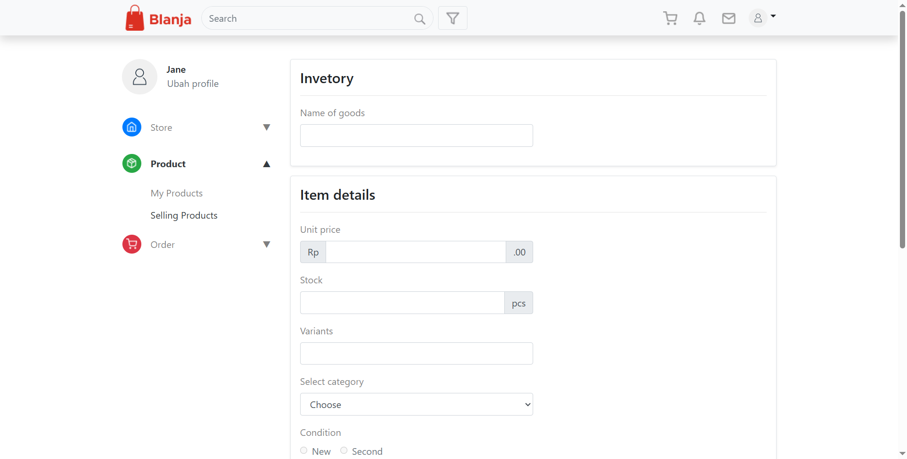</td>
  </tr>
   <tr>
    <td>Store products</td>
    <td>Selling product</td>
  </tr>
</table>
<!-- CONTRIBUTING -->

## Contributing

Contributions are what make the open source community such an amazing place to be learn, inspire, and create. Any contributions you make are **greatly appreciated**.

1. Fork the Project
2. Create your Feature Branch (`git checkout -b feature/AmazingFeature`)
3. Commit your Changes (`git commit -m 'Add some AmazingFeature'`)
4. Push to the Branch (`git push origin feature/AmazingFeature`)
5. Open a Pull Request

## Related Project

:rocket: [`Backend Blanja`](https://github.com/msuryasyahruli/backend-blanja-web)

:rocket: [`Frontend Blanja`](https://github.com/msuryasyahruli/blanja-web)

:rocket: [`Demo Blanja`](https://blanja-market-web.vercel.app/)

Project Link: [https://github.com/msuryasyahruli/blanja-web](https://github.com/msuryasyahruli/blanja-web)
